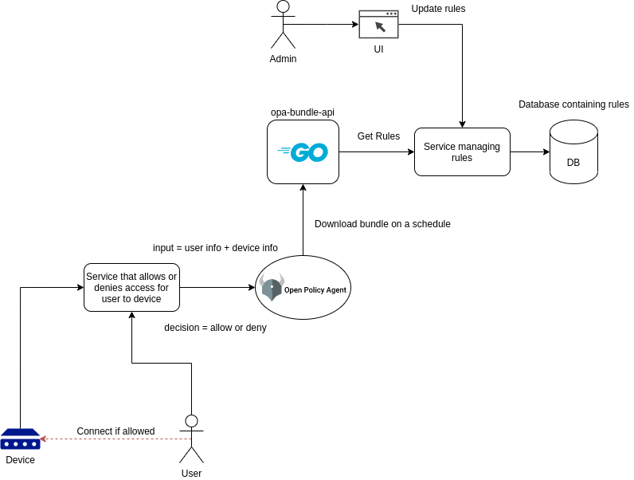

# opa-bundle-api
Proof-of-concept for an API to produce OPA bundles

## Service overview

The proof of concept is to show that it is possible to generate Open Policy Agent bundles dynamically and have OPA periodically download them (if changed).

The whole picture would look something like this:



In the proof of concept, there's no additional services for allowing/denying access, updating the database etcetera but shows how the concept could be.

## Additional information

### Rules

A rule looks like this in the code:

```Golang
type Rule struct {
	ID         ID     `json:"id"`
	Country    string `json:"country"`
	City       string `json:"city"`
	Building   string `json:"building"`
	Role       string `json:"role"`
	DeviceType string `json:"device_type"`
	Action     string `json:"action"`
}
```

It will look something like this in the bundle (`data.json`):

```json
{
  "rules": [
    {
      "action": "allow",
      "building": "ANY",
      "city": "ANY",
      "country": "ANY",
      "device_type": "ANY",
      "id": 1,
      "role": "super_admin"
    },
    {
      "action": "allow",
      "building": "ANY",
      "city": "ANY",
      "country": "Sweden",
      "device_type": "ANY",
      "id": 2,
      "role": "sweden_admin"
    }
  ]
}
```

Look at [pkg/rule/rule.go](pkg/rule/rule.go) to dig deeper.

### Policy

You can find the only current policy here: [rule.rego](pkg/bundle/static/rule.rego)

This file will be embedded in the Golang binary at compilation and used together with the dynamic rules to create the [OPA Bundle](https://www.openpolicyagent.org/docs/latest/management-bundles/).

The important parts of the current rule are:

- The keyword `ANY` for `country`, `city`, `building`, `role` and `device_type` means a wildcard.
- The keyword `undefined` for `action` means it will use the default action which is `action = deny`
- Any matches `action = allow` will allow access as long as there are no matches for `action = deny`
- Even if there are multiple rules that gives a user `action = allow`, a single `action = deny` will set `allow` to `false` 

### Source code

#### cmd/opa-bundle-api

File: [`cmd/opa-bundle-api/main.go`](cmd/opa-bundle-api/main.go)

- Loads the repository (`database`) containing the rules, adds a few pre-defined rules to it. 
- Loads the OPA Bundle client (`bundleClient`) and starts the API.

#### pkg/bundle

Directory: [`pkg/bundle`](pkg/bundle)

- Contains the logic around building OPA Bundles.
- Contains static rules for OPA (written in `rego`) which are added to the bundles

#### pkg/config

Directory: [`pkg/config`](pkg/config)

- The application configuration built with [urfave](https://github.com/urfave/cli)
- Overly complex for the proof-of-concept, but copied from another [project](https://github.com/XenitAB/mqtt-log-stdout)

#### pkg/handler

Directory: [`pkg/handler`](pkg/handler)

- Contains the logic for the REST API, invoked as Echo handlers

#### pkg/rule

Directory: [`pkg/rule`](pkg/rule)

- Contains the repository (`database`) for all the rules that are injected into the bundle
- Here is the logic around adding new rules, showing them etcetera

#### pkg/util

Directory: [`pkg/util`](pkg/util)

- Just some utils, hashing of data to become `revision` and `ETag` as an example

### API

The API (built with [`Echo`](https://echo.labstack.com/)) takes care of everything right now and at start-up populates a few pre-defined rules.

Right now it is self contained, but could just as well read the data about the rules from a database or another API. Using a hashmap for convinience.

#### Endpoints

- `GET /rules`: reads all rules
- `POST /rules`: creates a rule
- `GET /rules/:id`: reads rule with `:id`
- `PUT /rules/:id`: updates rule with `:id`
- `DELETE /rules/:id`: deletes rule with `:id`
- `GET /bundle/bundle.tar.gz`: downloads the current OPA bundle (containing the module + dynamic data)

## Running with docker-compose

Start:

```shell
docker-compose up
```

Stop with `CTRL+C`

## Testing API with cURL

### Download bundle

```shell
curl localhost:8080/bundle/bundle.tar.gz --output /tmp/bundle.tar.gz
```

### Download bundle (with If-None-Match)

If the header matches the current revision, a status code `304` should be returned.

```shell
curl --header "If-None-Match: 476d1f14d83110241366a81f82753523b850e150f55ed51bf5379f40cabc323d" localhost:8080/bundle/bundle.tar.gz --output /tmp/bundle.tar.gz
```

### Test bundle with OPA

```shell
opa eval --bundle /tmp/bundle.tar.gz --format pretty 'data.rules[i].id == 1; data.rules[i].role'
```

This should output the first role, something like:

```shell
+---+--------------------+
| i | data.rules[i].role |
+---+--------------------+
| 0 | "super_admin"      |
+---+--------------------+
```

### Read All Rules

```shell
curl localhost:8080/rules
```

### Read Rule

```shell
curl localhost:8080/rules/1
```

### Create Rule

```shell
DATA='{"country": "Iceland", "city": "Reykjavik", "building": "Branch", "role": "user", "device_type": "Printer", "action": "allow"}'
curl -X POST --header "Content-Type: application/json" --data $DATA localhost:8080/rules
```

### Update Rule

```shell
DATA='{"country": "Iceland", "city": "Reykjavik", "building": "Branch", "role": "user", "device_type": "Printer", "action": "allow"}'
curl -X PUT --header "Content-Type: application/json" --data $DATA localhost:8080/rules/1
```

### Delete Rule

```shell
curl -X DELETE localhost:8080/rules/1
```

## Testing OPA with cURL

### Get Policies

```shell
curl localhost:8181/v1/policies
```

### Test Policy

`Allowed`:

```shell
DATA='{"input":{"user":"Simon","country":"Sweden","city":"Alingsås","building":"Branch","role":"user","device_type":"Printer"}}'
curl -X POST --header "Content-Type: application/json" --data $DATA localhost:8181/v1/data/rule/allow
```

`Denied`:

```shell
DATA='{"input":{"user":"Simon","country":"Sweden","city":"Alingsås","building":"HQ","role":"user","device_type":"Printer"}}'
curl -X POST --header "Content-Type: application/json" --data $DATA localhost:8181/v1/data/rule/allow
```